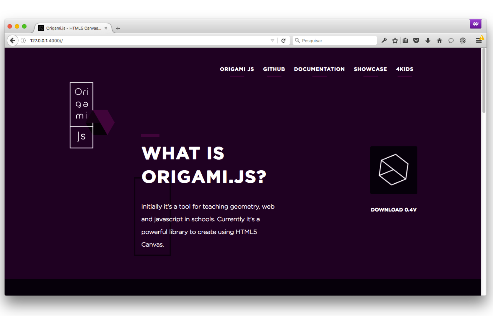

# origami.js

> The website of [Origami.js](https://github.com/raphamorim/origami.js)

<a href="http://origamijs.com/"></a>

## Install

- First, make sure you have installed on your computer the [Ruby](http://www.ruby-lang.org/pt/downloads/) to run this project.

- After, install [Jekyll](http://jekyllrb.com/) with the following command:
```sh
  $ gem install jekyll
```

- Clone this project and navigate to the folder:
```sh
  $ git clone https://github.com/raphamorim/origamijs.com.git && origamijs.com
```

- Finally, start the project:
```sh
  $ jekyll serve
```

The server should be initialized at localhost:4000

### More info:

  This site is built with Jekyll, as you may have noticed.

  Site content is written in Markdown format. Pull requests welcome!

  For the organization and maintenance of style sheets, we use the concept of [Atomic Design](http://bradfrost.com/blog/post/atomic-web-design/) by Brad Frost


## License

[MIT License](https://github.com/raphamorim/origamijs.com/blob/develop/licence) © Raphael Amorim
